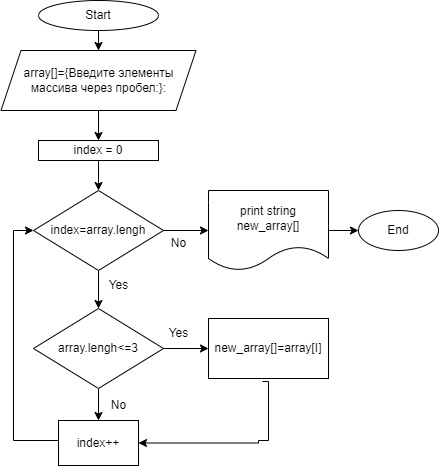

## *Задача:* ##

Написать программу, которая из имеющегося массива строк формирует новый массив из строк, длина которых меньше, либо равна 3 символам. Первоначальный массив можно ввести с клавиатуры, либо задать на старте выполнения алгоритма. При решении не рекомендуется пользоваться коллекциями, лучше обойтись исключительно массивами.

## Блок-схема ##



## Решение ##

* Ввод инфрмации через консоль.

```
Console.Write("Введите элементы массива через пробел: ");
```

* Создание метода SecondArray

>Cоздаем метод сортирующий символы из массива. Cначала отсчитываем количество, удовлетворяющих требований, для определения длинны нового массива. Cоздаем массив по выясненому количествуи заносим туда символы удовлетворяющие требованиям.

* Создание метода PrintArray

>Cоздаем метод для вывода информации из массивов с использованием цеклического вывода каждого элемента массива.

* Вывод информации
```
Console.WriteLine(string.Join(" ",new_array));
```